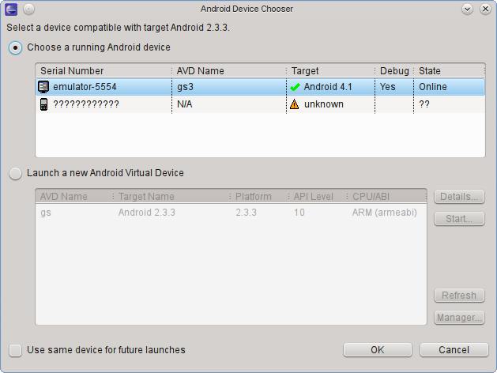
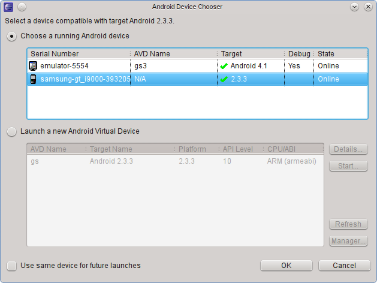

Android dev tips & tricks
#########################

:tags: Android, Linux, openSuse
:lang: hr
:slug: android-dev-tips
:date: 2012-07-01
:status: draft

Pokretanje aplikacije na uređaju
--------------------------------

Pokretanje aplikacije direktno na uređaju iz eclipsea.
`Detaljna uputstva <http://developer.android.com/tools/device.html>`_.
Prvo na mobitelu napraviti ::

    Settings -> Applications -> Development -> USB debugging (staviti kvacicu)

Ako se sad pokusa pokrenuti app dobije se:

Treba generirati fajl ::

    /etc/udev/rules.d/42-android-devices.rules

Sadrzaja: ::

    SUBSYSTEM=="usb", ATTR{idVendor}=="04e8", MODE="0666", GROUP="users"

Sada ga vidi!!

04e8 je samsung ...

