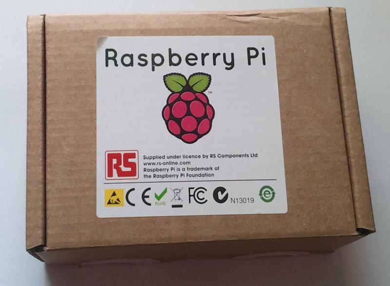
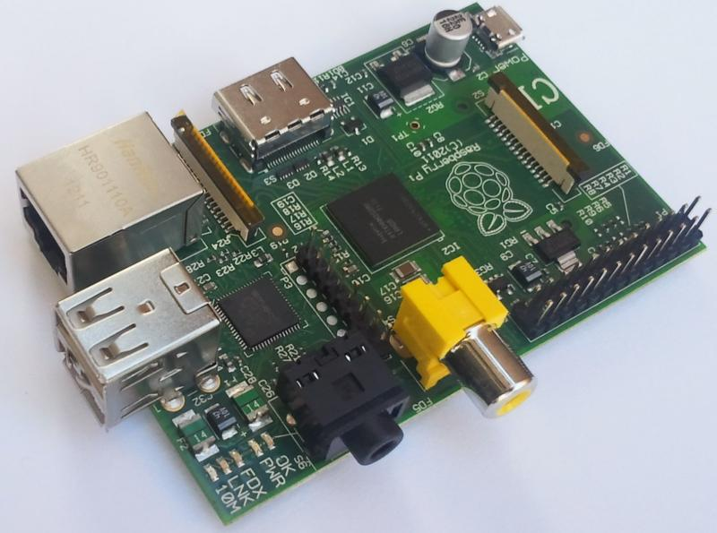
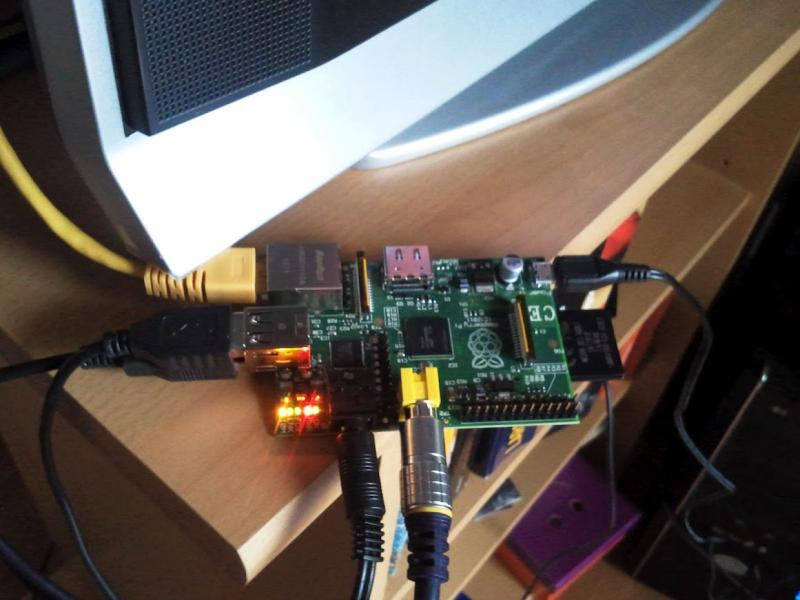

Raspberry Pi - prvi dojmovi
###########################

:tags: RPi, Raspberry Pi
:lang: hr
:slug: rpi-prvi-dojmovi

RPi je stigao. Malo računalo u maloj kutiji.

Planirano je da RPi dolazi u dvije varijanete, Model A i Model B. Model A je jeftinija varijanta, zvanična cijena mu je 25 USD  no zasad se proizvodi samo model B i to po cijeni od 35 USD. Koliko stvarno košta da ga se dobije u lijepu našu, saznajte u nastavku. 
Raspberry Pi model B pogoni Broadcom BCM2835 procesor koji kuca na 700 MHz. Model B također ima modul
od 256 Mb radne memorije koja se dijeli između centralnog procesora i grafičkog procesora. 
Po defaultu centralnom procesoru ostaje 186 MB. Prisutna su dva USB 2.0 priključka, HDMI izlaz, 
3.5mm audio i RCA kompozitni izlaz. 
Raspberry Pi se na mrežu može spojiti putem RJ45 ethernet porta koji dolazi isključivo u modelu B.

RPi model B, spojen analogno na TV, spojeni miš, tipkovnica i eksteni disk:

Ono što nećete dobiti uz RPi, a nužno je za njegov rad, je SD memorijska kartica.

SD kartica s predinstaliranim operativnim sustavom se može naručiti prilikom kupnje no u trenutku naručivanja ovog uređaja bile su rasprodane. Dakle, za pokretanje RPi-a potrebno je imati pri ruci jednu SD karticu kapaciteta barem 2 GB te se na nju mora nasnimiti slika koja sadrži operativni sustav. Na službenim download stranicama RPi-a dostupne su tri takve slike, od
kojih se za početak preporučuje Debian squeeze pa sam odlučio svoje druženje s RPi-om započeti upravo tom slikom.

Instalacija slike
-----------------

Prvo je potrebno skinuti sliku koju planiramo staviti na SD karticu. U ovom slučaju to je 
debian6-19-04-2012.zip koja se nalazi na službenoj download stranici.

Zatim sliku treba otpakirati ::

    $ unzip debian6-19-04-2012.zip

Time se dobije debian6-19-04-2012.img datoteka koja sadrži sliku.

Da bi na SD karticu stavili sliku, potrebno je imati neki čitač kartica i spojiti karticu na računalo.
Zatim moramo utvrditi pod kojim imenom je kartica prepoznata:
Naredbom df -h možemo vidjeti novo mountane diskove te prepoznati našu SD karticu.
Ako izvršimo tu naredbu prije i poslije umetanja kartice možemo uočiti nove zapise i prepoznati karticu

::

    $ df -h
    Filesystem      Size  Used Avail Use% Mounted on
    rootfs           19G  7.5G   10G  43% /
    devtmpfs        2.0G   36K  2.0G   1% /dev
    tmpfs           2.0G  2.6M  2.0G   1% /dev/shm
    tmpfs           2.0G  716K  2.0G   1% /run
    /dev/sda6        19G  7.5G   10G  43% /
    tmpfs           2.0G     0  2.0G   0% /sys/fs/cgroup
    tmpfs           2.0G  716K  2.0G   1% /var/lock
    tmpfs           2.0G  716K  2.0G   1% /var/run
    tmpfs           2.0G     0  2.0G   0% /media
    /dev/sda7       244G   30G  203G  13% /home
    /dev/sda2       196G  127G   69G  65% /windows/C
    /dev/sdd1        63M  6.0M   58M  10% /media/B757-8716
    /dev/sdd3       7.2G  1.6G  5.2G  24% /media/14fa9af4-552a-4f53-88ad-3259f189fccf

Vidimo da je kartica prepoznata kao /dev/sdd

Prije nastavka potrebno je unmountati sve particije koje se nalaze na kartici, u ovom slučaju to su /dev/sdd1 i /dev/sdd3

::

    $ umount /dev/sdd1
    $ umount /dev/sdd3

Slika se sada snimi na karticu s ::

    # dd bs=1M if=debian6-19-04-2012.img of=/dev/sdd

pa onda ::

    # sync

Ovako pripremljena kartica je dovoljna da se RPi boota.
Nema on/off gumba, stvar se ušteka i radi. 
RPi s ovom debian slikom se boota u terminal i prvi boot traje oko 4.5 minute, a svaki sljedeći oko jedne minute. 

Defaultni username za ovu sliku je pi i pripadni password je raspberry.

Prvo što upada u oči nakon boota je činjenica da ovakav način pripremanja kartice koristi samo
onaj dio kartice koji je predviđen slikom, odnosno 2 GB.
Iako je moja testna kartica kapaciteta 8 GB, RPi vidi i koristi samo 2 GB,
što korisniku ostavlja na koristenje cijelih 298 MB. Neke druge slike kao
primjerice raspbmc pobrinu se da je cijela kartica raspoloživa.
Nakon prvog boota diskovna situacija izgleda ovako: ::

    pi@raspberrypi:~$ df -h
    Filesystem            Size  Used Avail Use% Mounted on
    tmpfs                  94M     0   94M   0% /lib/init/rw
    udev                   10M  152K  9.9M   2% /dev
    tmpfs                  94M     0   94M   0% /dev/shm
    rootfs                1.6G  1.2G  298M  80% /
    /dev/mmcblk0p1         75M   28M   47M  37% /boot

Da bi doskočili ovom problemu potrebno je promijeniti veličinu root particije:
(izvor https://www.youtube.com/watch?v=R4VovMDnsIE).

Disk na kojem je particija kojoj želimo promijeniti veličinu je /dev/mmcblk0, sufiksi p1, p2 itd. su oznake particije.

Sve ovo radimo direktno na RPi-u: ::

    # fdisk -uc /dev/mmcblk0

naredbom p izlistamo informacije o particijama.

::

    Command (m for help): p

    Disk /dev/mmcblk0: 7969 MB, 7969177600 bytes
    4 heads, 32 sectors/track, 121600 cylinders, total 15564800 sectors
    Units = sectors of 1 * 512 = 512 bytes
    Sector size (logical/physical): 512 bytes / 512 bytes
    I/O size (minimum/optimal): 512 bytes / 512 bytes
    Disk identifier: 0x000ee283

            Device Boot      Start         End      Blocks   Id  System
    /dev/mmcblk0p1            2048      155647       76800    c  W95 FAT32 (LBA)
    /dev/mmcblk0p2          157696     3414015     1628160   83  Linux
    /dev/mmcblk0p3         3416064     3807231      195584   82  Linux swap / Solaris

Mijenjamo veličinu particiji /dev/mmcblk0p2. 
Prvo izbrišemo particiju komandom d i damo mu broj particije (2 i 3 u ovom slučaju) ::

    Command (m for help): d
    Partition number (1-4): 2

    Command (m for help): d
    Partition number (1-4): 3

Sada napravimo particiju
(n p 2) i za početak sektora stavimo početak stare particije te za veličinu izaberemo defaultnu ponuđenu vrijednost, kako bi se particija proširila na ostatak diska: ::

            Device Boot      Start         End      Blocks   Id  System
    /dev/mmcblk0p1            2048      155647       76800    c  W95 FAT32 (LBA)
    /dev/mmcblk0p2          157696     3414015     1628160   83  Linux
    /dev/mmcblk0p3         3416064     3807231      195584   82  Linux swap / Solaris

    Command (m for help): d
    Partition number (1-4): 2

    Command (m for help): d
    Partition number (1-4): 3

    Command (m for help): n
    Command action
       e   extended
       p   primary partition (1-4)
    p
    Partition number (1-4): p
    Partition number (1-4): 2
    First sector (155648-15564799, default 155648): 157696

Naredbom w snimimo promjene. Također je potrebno ponovno pokrenutu RPi. ::

# reboot

Nakon ponovnog ulogiravanja napravimo resize ::

    # resize2fs /dev/mmcblk0p2

Root particija je sada rastegnuta preko cijele kartice: ::

    pi@raspberrypi:~$ df -h
    Filesystem            Size  Used Avail Use% Mounted on
    tmpfs                  94M     0   94M   0% /lib/init/rw
    udev                   10M  148K  9.9M   2% /dev
    tmpfs                  94M     0   94M   0% /dev/shm
    rootfs                7.3G  1.2G  5.8G  17% /
    /dev/mmcblk0p1         75M   28M   47M  37% /boot

U jednom od prethodnih koraka odabrali smo opciju da se root particija proširi na cijeli disk
pa sada nema mjesta za swap particiju (budući da RPi ima svega 256 MB radne memorije, malo swapa neće škoditi). To ćemo riješiti ovako ::

    # dd if=/dev/zero of=/var/swapfile bs=1M count=128
    # mkswap /var/swapfile
    # swapon /var/swapfile
    # reboot

Editirati datoteku: /etc/fstab iz ovog: ::

    proc            /proc           proc    defaults        0       0
    /dev/mmcblk0p1  /boot           vfat    defaults        0       0
    #/dev/mmcblk0p3  none            swap    sw              0       0

u ovo: ::

    proc            /proc           proc    defaults                                0       0
    /dev/mmcblk0p1  /boot           vfat    defaults                                0       0
    /dev/mmcblk0p2  /               ext4    defaults,noatime,nodiratime             0       0
    /var/swapfile   none            swap    sw                                      0       0

Debian radi uredno. Repozitoriji su dostupni i bez nekih problema sam uspio instalirati nekoliko
paketa. Debian dolazi s LXDE-om, ali X server ne diže pri bootu. Dizanje X-a traje oko 20 sekundi, što i nije pretjerano dugo. Prvo dizanje midorija nakon boota traje oko dvije i pol minute, ali svako sljedeće je puno brže, oko 8 sekundi. Ono što ne radi, odnosno ne radi dobro out of the box, je multimedija. Umjesto da pokušavam natjerati multimediju da se pristojno ponaša na debianu, posegnuo sam za popularnom alternativom, Raspbmc-om.

Raspbmc
-------

Raspbmc je napravljen s jednom svrhom, a to je multimedija. Napravljen je povrh debiana te koristi
xbmc za upravljanje sadržajem.

Slika Raspbmc se može skinuti s http://download.raspbmc.com/downloads/bin/ramdistribution/installer-testing.img.gz

Smještanje slike na karticu se odvija isto kao kod debiana. 
Za razliku od debiana, tim postupkom se na karticu postavi instaler. Za dovršetak instalacije dovoljno je upaliti RPi i spojiti ga na mrežu. Instaler će sam odraditi ostatak posla.

Za razliku od debiana, raspbmc će iskoristiti cijeli kapacitet SD kartice.

Multimedija radi iznenađujuće dobro. RPi je dovoljno snažan da glatko vrti filmove HD kvalitete.
Mali bug primjećen je kod reprodukcije glazbe, naime, ako se pjesma ne odsluša do kraja, nego
se prije kraja pokrene neka druga pjesma, ta druga neće svirati.

XBMC povremeno u terminal zapiše neku poruku (najčešće opis neke greške zapiše na stderr).
Ako se u tom trenutku reproducira neki film, koji je takvog formata da slika nije prikazana 
preko cijelog ekrana, onda se ta poruka vidi u crnom predjelu ispod i iznad slike.

.. image :: slike/RPi_stderr.jpg

Korisna napomena; ako se RPi ne spaja na TV (ili monitor) preko HDMI-a, nego analogno,
onda se obavezno u postavkama XBMC-a audio output mora staviti na analog, u suprotnom se pri pokretanju filma dobije ovo: 

.. image :: slike/RPi_audio_analog.jpg

Zgodna je činjenica da raspbmc po defalutu pokreće SSH server pa, ako se nekako može dokučiti IP
adresa stroja, jedino što je potrebno da bi se na RPi-u nešto radilo je RJ45 kabel, dok su kod debiana potrebni ekran i tipkovnica barem kod prvog boota.

Dojmovi
-------

RPi se uredno spojio na mrežu (DHCP), tipkovnica i miš su također uredno prepoznati.
RPi je bio spojen na stari TV i slika i zvuk su uredno preneseni. USB konektori su smješteni jako blizu jedan drugom, pa ako planirate imati spojen uređaj koji
je malo deblji, kao npr. USB stick ili wifi adapter, potrebno je imati nekakav produžni ili hub.

Debian radi poprilično dobro, rad u terminalu je malčice spor, ali je RPi za tu svrhu definitivno upotrebljiv.
Rad u grafičkom sučelju je osjetno sporiji. Kao glavna uloga RPi-a ističe se ona edukacijska i to u svrhu učenja programiranja. Ako se sjetimo da se uz učenje puno puta treba posjetiti
Duck Duck Go i imati otvoreno nekoliko (desetaka) tabova, učenje programiranja uz RPi bi
predložio samo ljudima koji imaju puno strpljenja i kvalitetnu literaturu u tiskanom obliku.

Kao jedna od najpopularnijih primjena RPi-a se spominje ona gdje RPi glumi media centar. 
Softver koji ga nekako najbliže dovodi tom cilju, raspbmc, još ipak nije spreman. Iako se filmovi vrte glatko, samo sučelje XBMC-a malo zapinje. Nedostatak podrške za neke kodeke i sitni iritanti bugovi su dovoljni razlozi da zaključavanje svog HTPC-a na tavan odgodite na još barem neko vrijeme. 

I koliko košta Pi od 35 dolara?
-------------------------------

Raspberry Pi, punjač, dva kabela za spojiti na TV i dostava dođe oko 350 kuna.
Carina je oko 250 kuna. RPi je neupotrebljiv bez SD kartice, koja se može dobiti za nekih
66 kuna (8 GB, class 10). Ukupno oko 666 kn.